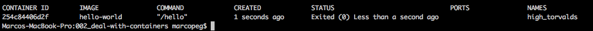

# Deal With Containers

Let's take the instruction you learned in the [previous lesson](../001_run-hello-world/README.md) and run it without arguments:

	docker run hello-world
	
The output is the very same, nothing special here.

## List existing containers

When you run an _image_ Docker creates a _container_ which is basically an executable instance of that instance. But, wait, where does this thing go?

Well, obviously Docker stores a lot of files somewhere in your computer (that level of details is beyond the scope of those tutorials) but you can at least list all your containers by running:

	docker ps -a
	
> `-a` stands for "all". If you omit this flag Docker lists only your
> running containers, with the flag you will see all of them.

## Container Identifier

Docker identifies every container in two ways:

**CONTAINER ID** targets a _machine2machine identification_. Docker generates it for you and you just have to like it (or save it to an environment variable).

**CONTAINER NAME** targets human beings like me and you. Docker likes to generate funny names but it also allows you to set a specific name for a container (we'll get to that point soon enough).

## Remove a container

Every container consume memory.  
You don't want to waste memory on an _Hello World_ container, or do you?

Well, I assume you are a cleaning freak like me (only applied to your fs ofc!) and you want to remove unuseful stuff asap:

	docker rm {{ID || NAME}}

## Cleanup Everything

While you learn Docker you may want to clean up your computer from all the existing containers because you will be busy creating new ones every second of your life. Here is the script:

	# remove all containers
	docker stop $(docker ps -aq) && docker rm $(docker ps -aq)