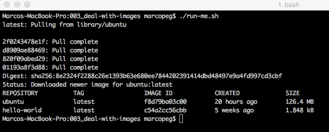

# Deal With Images

A **docker image** is the prototype Docker uses to build containers.

## List existing images

Docker stores all the images you use to create containers in your local machine. You can see them all with the following command:

	docker pull ubuntu && docker images

> **Oh wait! Why do I see two images?**
>
> As expected you see an "ubuntu" image (we just pulled it), but you can also see an 
> "hello-world" (I'm assuming you are running all the examples of those tutorials, 
> please do that and tell your friends!). 
>
> This happens because whenever you `docker run` an 
> image that is not locally available, Docker will automagically pull it for you.

## Docker Hub

Have you ever wake up wondering:

> From where my images come from?  
> - <small>me in the morning</small>

I did once, and I got lucky as the answer is straightforward: **images come from [DockerHub](https://hub.docker.com/)**.  
You can think of DockerHub as a GitHub for Docker images.

Every image can be versioned, pulled and pushed just like a GitHub repository:

- of course you can create your own account
- of course you can push your own images
- of course it is free for public projects!

## Image Identifier

An image is universally idetified by string:

	{host}/{username}/{image-name}:{image-tag}
	
If you omit the host Docker assumes it to be DockerHub.  
<small>(yes, you can create your own private images repository)</small>

When you download an image Docker assign to her a local identifier whit a _machine2machine_ purpose (I challenge you to remember those ids!)

Of course you will use the human readable name to `pull` or `run` a specific image.

## Remove an image

Every image holds memory.  
You don't want to waste memory on an _Hello World_ image, or do you?

Well, I assume you are a cleaning freak like me (only applied to your fs ofc!) and you want to remove unuseful stuff asap:

	docker rmi {{IMAGE_NAME || IMAGE_ID}}
	
**NOTE:** you must remove all the image based containers before Docker allows you to actually remove that image.

## Cleanup Everything

While you learn Docker you may want to clean up your computer from all the existing images because you will be busy fetching new ones every second of your life. Here is the script:

	# remove all the images
	docker rmi $(docker images -q)
	
**NOTE:** you must remove all the images based containers before Docker allows you to actually remove that image.
	
## Custom Images

One of the most powerful and interesting features of Docker are the ability to build **custom images**. We will cover this argument later on but, for now, you may just be happy to know that you can do something like that:

- pull an _ubuntu_ image
- install all the software you may need
- build a new image with all your customisations
- push that new image for everybody to enjoy (or distribute it privately too!)