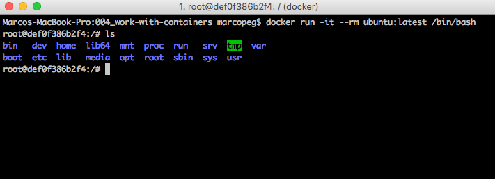

# Work with Containers

One of the basic useful things offered by Docker is the ability to run a _Linux_ box within a Mac, Windows (and even another Linux!) which happens to be completely (and safely) isolated from your working machine.

The simplest possible thing to do is to try to run a bash terminal inside a Docker machine... because you may want to practice with a Linux box but you don't want to mess up with your local OS:
	
	# run a bash terminal inside an Ubuntu based machine
	docker run -it --rm ubuntu:latest /bin/bash
	
## What the hell is that???

Ok, there are a couple of flags and even something else after the image name. Let's take it one by one:

### `-it`

Tell Docker to keep the running container **attached** to your working machine's terminal session. Basically it allows you to issue commands and read the output to/from the container.

### `--rm`

Docker will remove the container when you stop it.

### `/bin/bash`

Tell Docker which command to execute as soon the container is running. In this case you start a bash session.

As you may see the simplest possibile activity to do is to run some terminal commands like `ls` or `touch`. You have a fully working Ubuntu box to play with!

## exit the container

Ok, playing with a terminal session is cool and now you rightfully feel like an old time hacker. But it is time to get out of the rabbit hole and get back to reality. It's time to leave your Ubuntu machine and go back to your terminal:

	exit
	
This simple commands will perform the following actions:

- close the bash session on the Ubuntu machine
- stop the container
- remove the container (because on `--rm`)

### Things that are good to know:

If you created a file now it is lost forever bacause a running container file system is volatile by default, and you removed the container just after you stopped it (`--rm`, remember that?)

## attach / detach

Of course you are not doomed to loose your work every time you need to move from your Ubuntu terminal to you working machine's one. With Docker you can freely detach and attach your working machine's terminal to a running container:

1. start an interactive container: `docker run -it --name p1 ubuntu`
2. `touch aaa` to create a new file on the local fs
3. `ls` to verify your newly created file is ther
4. **detach** from the running container by typing: `Ctrl+p`, `Ctrl+q`
5. now you are in your host terminal, type `docker ps` to list your running containers. You should see your **p1** container which started a couple of minutes ago.
6. **attach** to the running container: `docker attach p1`
7. now you are in your Ubuntu terminal session, type `ls` to verify that your `aaa` file is still present.

## start / stop

Now you have a running Ubuntu container which your terminal is attached to. That is good but let say it's the end of the day and you want to go home. The best thing to do is:

- detach from your running container
- stop the container
- shut down your working machine
- **go for a beer**
- **sleep over**
- start your working machine
- start your Ubuntu container
- attach your terminal to it
- keep playing

Let's do that with Docker:

1. `Ctrl+p`, `Ctrl+q` to detach
2. `docker stop p1` to stop the container
3. `docker ps -a` to see that your container is still there, even if it has an "exited (0)" status.
4. -- see you tomorrow --
5. `docker start ps1` to **resume your container**
6. `docker attach p1` to attach your terminal to it and start working again
7. `ls` to verify that **your `aaa` file is still there**

### Things that are good to know:

Your container's volatile file system will be preserved by Docker until you remove your container. If you do not remove your container with `docker rm xxx`, the container's data will be preserved.

It may be interesting to know that you can even [_commit_ your file system changes into a new custom image](https://docs.docker.com/engine/reference/commandline/commit/) so to permanently store your work and, maybe, share with others through DockerHub.

