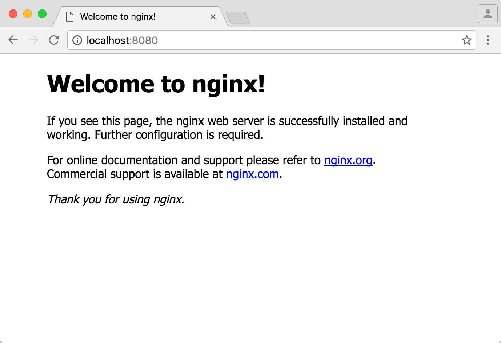

# Work with Volumes

Let's move to a more _real world oriented_ example and run an [NGiNX](https://nginx.org/) server to expose a static _HTML_ website.

_NGiNX_ is a web server application that [**comes as ufficial DockerHub image**](https://hub.docker.com/_/nginx/). That means that some really good guy took the time to package it with Docker and publish it.

Ufficial Docker images are availabe under the "_" namespace and are normally safe to use for both development and production purposes, well versioned and **almost quite well documented**. 

> **Don't worry** if you don't quite understand a normal Docker image documentation page.
> _"I've been there, I felt that way, it will pass"_. Just give yourself time to get used 
> to Docker and it's vocabulary and ways to think about software. Then one morning you 
> will wake up and understand everything.  
> [You'll see the light!](https://www.youtube.com/watch?v=lX5tfRdkoY0)

## Run the default setup

	docker run nginx
	
This command will pull the image to your working machine and run it. Too bad is quite unuseful because there is no ways to actually access the web server that is running inside the container!

## Expose port 80

NGiNX is running on port 80 by default, and you already know the flag we need to expose this port:

	docker run -p 8080:80 nginx
	
Remember that the port flag works as `{HOST_PORT}:{CONTAINER_PORT}`. For most of the available Docker images you find which port they expose in their documentation page. In the worst case you may just take a look at their _Dockerfile_ (but we'll get to that point later on).

If everything works fine you should now be able to open your browser and point it to `http://localhost:8080` and see something like this:

## Use your own files - meet Volumes

So far there is nothing really new but for the fact that we are using a real world web server application... by issuing one super simple Docker command!

Of course you want to serve your own mighty website which you have ready on your working machine in `/users/awesome/www/`. Basically you want to be able to run this website through NGiNX without install NGiNX on your working machine.

What you need is to specify a _Volume_ to your running container.

> A _Volume_ is a rule that maps a path inside a running container to a path on 
> your working machine. More or less what you aready did with the port.

	docker run \
		-p 8080:80 \
		-v /users/awesome/www:/usr/share/nginx/html \
		nginx
		
- `/usr/share/nginx/html` is the default path, from the container's point of view, in which NGiNX will look for files to serve. It was configured by the smart guy that prepared the NGiNX ufficial image and it is documented in the documentation page.
- `/users/aswesome/www` is a path in your working machine where you wrote your `index.html` file (and all the rest).

The mapping tells Docker something like this:

> Every time you need a file from `/usr/share/nginx/html` go to my working machine's 
> file system and look inside `/users/aswesome/www`.

This is as simple as it can get! Of course there is more to tell about _Volumes_ but this is more or less the most used option when you use Docker to clean up your development environment.